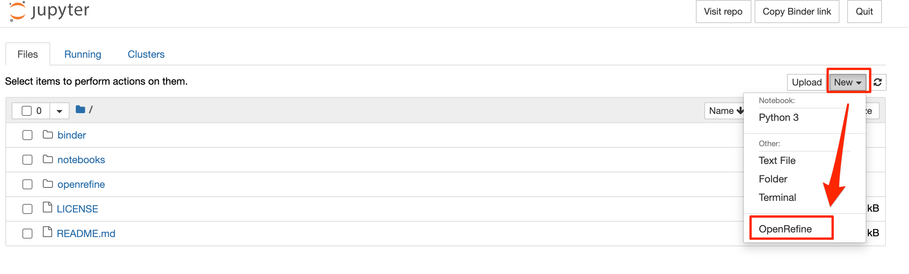
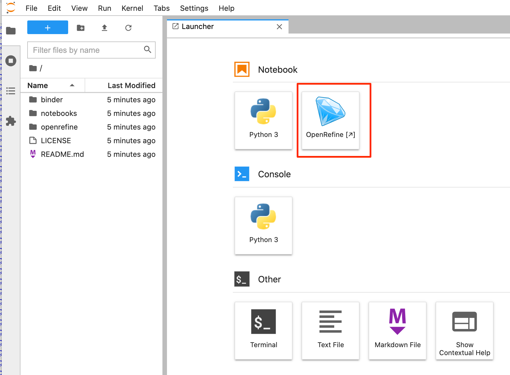
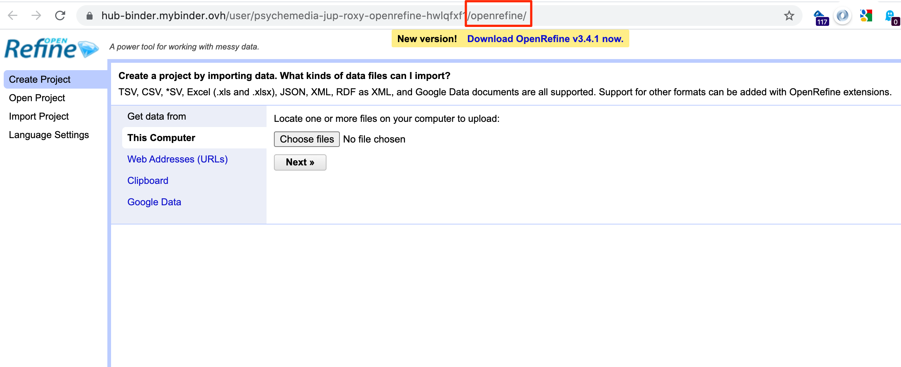

# nb_serverproxy_openrefine
Jupyter server proxy for OpenRefine

[Based on the original https://github.com/psychemedia/jupyterserverproxy-openrefine which has some docs, although the reponame/install instructions will need updating for this repo. *I will pop the package on PyPi at some point.*]

Jupyter-server-proxy config for running OpenRefine.

Open to Notebook homepage: 

Open to OpenRefine: 

Open to Jupyterlab: 

*Early original work on getting OpenRefine running in MyBinder was done by @betatim ([betatim/openrefineder](https://github.com/betatim/openrefineder)) and @yuvipanda helped me get my head round various bits of [jupyterhub/jupyter-server-proxy/](https://github.com/jupyterhub/jupyter-server-proxy/) which is key to proxying web services via Jupyter. @manics PR for handling predefined, rather than allocated, port mappings also made life much easier...*

OpenRefine can now be started and launched from the notebook homepage New menu or from the JupyterLab launcher.

The OpenRefine client can be found on the `openrefine` path (the port number is allocated dynamically).

Calling the path directly (eg starting MyBinder with the path `openrefine`, or adding `?urlpath=openrefine` to the Binder URL) will launch the Binder container directly into the OpenRefine GUI application.

